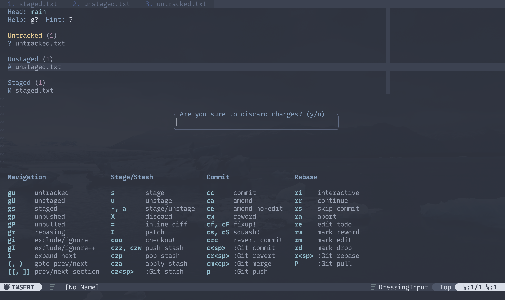

# Fugitive-Ext.nvim

Wrapper around the famous Git wrapper [fugitive](https://github.com/tpope/vim-fugitive).



## Getting Started

using [Lazy.nvim](https://github.com/folke/lazy.nvim),
```lua
{
    "bharam/fugitive-ext.nvim",
    dependencies = {
        "tpope/fugitive",

        -- optional plugins
        "tpope/vim-rhubarb", -- fugitive extension for GitHub
        "junegunn/gv.vim",   -- git commit browser
    }
}
```

## **Hint** floating window

Used to display customizable keymap hints at the bottom of fugitive as a float. Toggle
the **hint** by pressing `?` in fugitive.


## Actions

Re-exported git actions from [fugitive](https://github.com/tpope/vim-fugitive) plus some extras.

<details>
<summary>List of actions</summary>

- Consult with fugitive help doc for detailed explanation of keymap (`h: fugitive_s`).
- Actions end with `_confirm` simply asks for confirmation before invoking the git command
    provided by fugitive

#### Staging/Unstaging

| Action                       | Fugitive Keymap / Description                |
| ---                          | ---                                          |
| stage                        | `s`                                          |
| unstage                      | `u`                                          |
| unstage_all                  | `U`                                          |
| toggle_stage                 | `a`, `-`                                     |
| discard                      | `X`                                          |
| inline_diff                  | `=`                                          |
| patch                        | `I`, `P`                                     |
| exclude_ignore_add           | `[count]gI`                                  |
| discard_confirm              | Confirm to `discard`                         |

### Navigation

| Action                       | Fugitive Keymap / Description                |
| ---                          | ---                                          |
| untracked                    | `gu`                                         |
| unstaged                     | `gU`                                         |
| staged                       | `gs`                                         |
| unpushed                     | `gp`                                         |
| unpulled                     | `gP`                                         |
| rebasing                     | `gr`                                         |
| exclude_ignore_open          | `[count]gi`                                  |
| jump_prev_hunk               | `(`                                          |
| jump_next_hunk               | `)`                                          |
| expand_prev_hunk             | `[c`, `i`                                    |
| expand_next_hunk             | `]c`                                         |
| collapse_curr_goto_prev      | `[/`, `[m`                                   |
| collapse_curr_goto_next      | `]/`, `]m`                                   |
| collapse_curr_expand_prev    | Combination of `[m` and `i`                  |
| collapse_curr_expand_next    | Combination of `]m` and `i`                  |
| prev_section                 | `[[`                                         |
| next_section                 | `]]`                                         |
| prev_section_end             | `[]`                                         |
| next_section_end             | `][`                                         |

#### Commit

| Action                       | Fugitive Keymap / Description                |
| ---                          | ---                                          |
| commit                       | `cc`                                         |
| commit_amend                 | `ca`                                         |
| commit_amend_no_edit         | `ce`                                         |
| commit_reword                | `cw`                                         |
| fixup_commit                 | `cf`                                         |
| fixup_commit_rebase          | `cF`                                         |
| squash_commit                | `cs`                                         |
| squash_commit_rebase         | `cS`                                         |
| squash_edit_msg              | `cA`                                         |
| commit_cmdline               | `c<space>`                                   |
| revert_commit                | `crc`                                        |
| revert_no_commit             | `crn`                                        |
| revert_cmdline               | `cr<space>`                                  |
| merge_cmdline                | `cm<space>`                                  |
| commit_amend_confirm         | Confirm to `commit_amend`                    |
| commit_amend_no_edit_confirm | Confirm to `commit_amend_no_edit_no_confirm` |
| commit_reword_confirm        | Confirm to `commit_reword`                   |
| fixup_commit_confirm         | Confirm to `fixup_commit`                    |
| fixup_commit_rebase_confirm  | Confirm to `fixup_commit_rebase`             |
| squash_commit_confirm        | Confirm to `squash_commit`                   |
| squash_commit_rebase_confirm | Confirm to `squash_commit_rebase`            |
| squash_edit_msg_confirm      | Confirm to `squash_edit_msg`                 |
| revert_commit_confirm        | Confirm to `revert_commit`                   |
| revert_no_commit_confirm     | Confirm to `revert_no_commit`                |

#### Checkout/Branch

| Action                       | Fugitive Keymap / Description                |
| ---                          | ---                                          |
| checkout                     | `coo`                                        |
| checkout_cmdline             | `co<space>`                                  |
| branch_cmdline               | `cb<space>`                                  |
| checkout_confirm             |                                              |

#### Stash

| Action                       | Fugitive Keymap / Description                |
| ---                          | ---                                          |
| stash_push                   | `czz`                                        |
| stash_pop                    | `czp`                                        |
| stash_apply                  | `cza`                                        |
| stash_push_idx               | `czw`                                        |
| stash_pop_idx                | `czP`                                        |
| stash_apply_idx              | `czA`                                        |
| stash_cmdline                | `cz<space>`                                  |
| stash_push_confirm           | Confirm to `stash_push`                      |
| stash_pop_confirm            | Confirm to `stash_pop`                       |
| stash_apply_confirm          | Confirm to `stash_apply`                     |
| stash_push_idx_confirm       | Confirm to `stash_push_idx`                  |
| stash_pop_idx_confirm        | Confirm to `stash_pop_idx`                   |
| stash_apply_idx_confirm      | Confirm to `stash_apply_idx`                 |

#### Rebase

| Action                       | Fugitive Keymap / Description                |
| ---                          | ---                                          |
| rebase_interactive           | `ri`                                         |
| rebase_auto_squash           | `rf`                                         |
| rebase_upstream              | `ru`                                         |
| rebase_push                  | `rp`                                         |
| rebase_continue              | `rr`                                         |
| rebase_skip_commit           | `rs`                                         |
| rebase_abort                 | `ra`                                         |
| rebase_edit_todo             | `re`                                         |
| rebase_mark_reword           | `rw`                                         |
| rebase_mark_edit             | `rm`                                         |
| rebase_mark_drop             | `rd`                                         |
| rebase_cmdline               | `r<space>`                                   |
| rebase_interactive_confirm   | Confirm to `rebase_interactive`              |
| rebase_auto_squash_confirm   | Confirm to `rebase_auto_squash`              |
| rebase_upstream_confirm      | Confirm to `rebase_upstream`                 |
| rebase_push_confirm          | Confirm to `rebase_push`                     |
| rebase_continue_confirm      | Confirm to `rebase_continue`                 |
| rebase_skip_commit_confirm   | Confirm to `rebase_skip_commit`              |
| rebase_abort_confirm         | Confirm to `rebase_abort`                    |
| rebase_edit_todo_confirm     | Confirm to `rebase_edit_todo`                |
| rebase_mark_reword_confirm   | Confirm to `rebase_mark_reword`              |
| rebase_mark_edit_confirm     | Confirm to `rebase_mark_edit`                |
| rebase_mark_drop_confirm     | Confirm to `rebase_mark_drop`                |

#### Miscellaneous

| Action                       | Fugitive Keymap / Description                |
| ---                          | ---                                          |
| push_cmdline                 | Populate `:Git push` in command line        |
| pull_cmdline                 | Populate `:Git pull` in command line        |
| dot                          | `.`                                          |
| nop                          | `<Nop>` to disable default fugitive keymaps  |
</details>

## Keymap

Example keymap configuration
```lua
vim.api.nvim_create_autocmd("FileType", {
    group = vim.api.nvim_create_augroup("FugitiveExtKeymap", { clear = true }),
    pattern = "fugitive",
    callback = function()
        local actions = require("fugitive-ext.actions")

        -- Show/hide hint floating window
        vim.keymap.set("n", "?", actions.toggle_hint, { buffer = true })

        -- Populate `Git push ` and `Git pull` in command line
        vim.keymap.set("n", "p<space>", actions.push_cmdline, { buffer = true })
        vim.keymap.set("n", "P<space>", actions.pull_cmdline, { buffer = true })

        -- Prompt to confirm before executing discard action `:h fugitive_X`
        vim.keymap.set("n", "X", actions.discard_confirm, { desc = "Discard changes", buffer = true })

        -- Override default navigation keymap
        vim.keymap.set("n", "k", actions.goto_prev_hunk,            { buffer = true }) -- equivalent to `fugitive_(`
        vim.keymap.set("n", "j", actions.goto_next_hunk,            { buffer = true }) -- equivalent to `fugitive_)`
        vim.keymap.set("n", "(", actions.collapse_curr_expand_prev, { buffer = true }) -- equivalent to `fugitive_[m` then `fugitive_i`
        vim.keymap.set("n", ")", actions.collapse_curr_expand_next, { buffer = true }) -- equivalent to `fugitive_]m` then `fugitive_i`

        -- Swap `gu` and `gU` default keymaps
        vim.keymap.set("n", "gu", actions.goto_unstaged,  { buffer = true })
        vim.keymap.set("n", "gU", actions.goto_untracked, { buffer = true })
    end,
})
```
<!-- img -->

## Configuration

Fugitive-Extension comes with following defaults:

```lua
{
    -- Config for fugitive
    fugitive = {
        line_number = false,          -- `vim.wo.number` for fugitive buffer
        relative_number = false,      -- `vim.wo.relativenumber` for fugitive buffer
        help_header = {               -- Help header line to replace
            { "Help:", "g?" },
            { "Hint:", "?" },
        },
        help_header_delimiter = "  ", -- Delimiter between each help_header entries
    },
    -- Config for hint
    hint = {                          
        toggle_key = "?",             -- Keymap to toggle hint
        visibility = true,            -- Default visibility of hint when opening fugitive
        title = true,                 -- Display hint section titles
        fugitive_min_height = 40,     -- Minimum height of fugitive to show hint
        padding = {
            header = true,            -- Empty line before hint
            footer = true,            -- Empty line after hint
            line_leader = 2,          -- Number of spaces to pad the beginning of each line
            key_desc = 1,             -- Number of spaces between key and description
            section = 3,              -- Number of spaces between sections
        },
        sections = {
            {
                title = "Navigation",
                entries = {
                    { "gu", "untracked" },
                    { "gU", "unstaged" },
                    { "gs", "staged" },
                    { "gp", "unpushed" },
                    { "gP", "unpulled" },
                    { "gr", "rebasing" },
                    { "gi", "exclude/ignore" },
                    { "gI", "exclude/ignore++" },
                    { "i", "expand next" },
                    { "(, )", "goto prev/next" },
                    { "[c, ]c", "expand prev/next" },
                    { "[m, ]m", "clean prev/next" },
                },
            },
            {
                title = "Stage/Stash",
                entries = {
                    { "s", "stage" },
                    { "u", "unstage" },
                    { "-, a", "stage/unstage" },
                    { "X", "discard" },
                    { "=", "inline diff" },
                    { "I", "patch" },
                    { "coo", "checkout" },
                    { "czz", "push stash" },
                    { "czw", "push stash_idx" },
                    { "czp", "pop stash" },
                    { "cza", "apply stash" },
                    { "cz<sp>", ":Git stash" },
                },
            },
            {
                title = "Commit",
                entries = {
                    { "cc", "commit" },
                    { "ca", "amend" },
                    { "ce", "amend no-edit" },
                    { "cw", "reword" },
                    { "cf, cF", "fixup!" },
                    { "cs, cS", "squash!" },
                    { "crc", "revert commit" },
                    { "c<sp>", ":Git commit" },
                    { "cr<sp>", ":Git revert" },
                    { "cm<cp>", ":Git merge" },
                    { "P", ":Git push" },
                },
            },
            {
                title = "Rebase",
                entries = {
                    { "ri", "interactive" },
                    { "rr", "continue" },
                    { "rs", "skip commit" },
                    { "ra", "abort" },
                    { "re", "edit todo" },
                    { "rw", "mark reword" },
                    { "rm", "mark edit" },
                    { "rd", "mark drop" },
                    { "r<sp>", ":Git rebase" },
                },
            },
        },
    },
}
```
